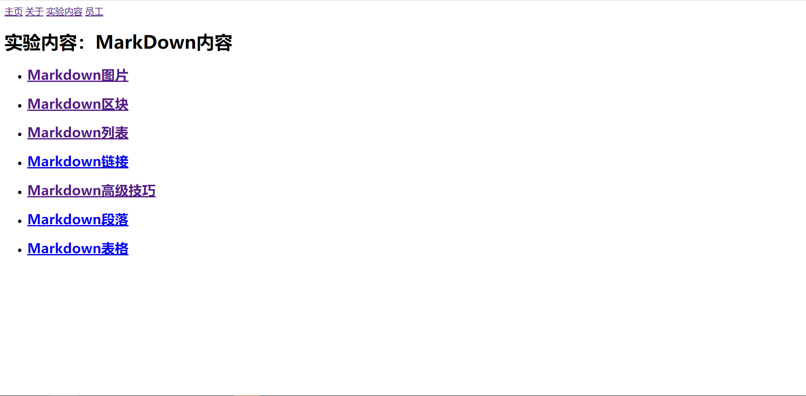
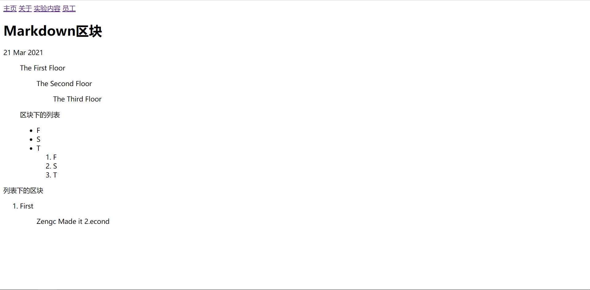
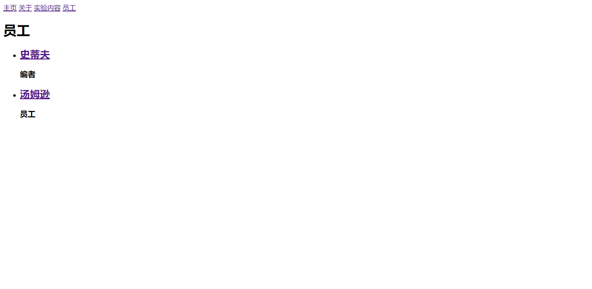
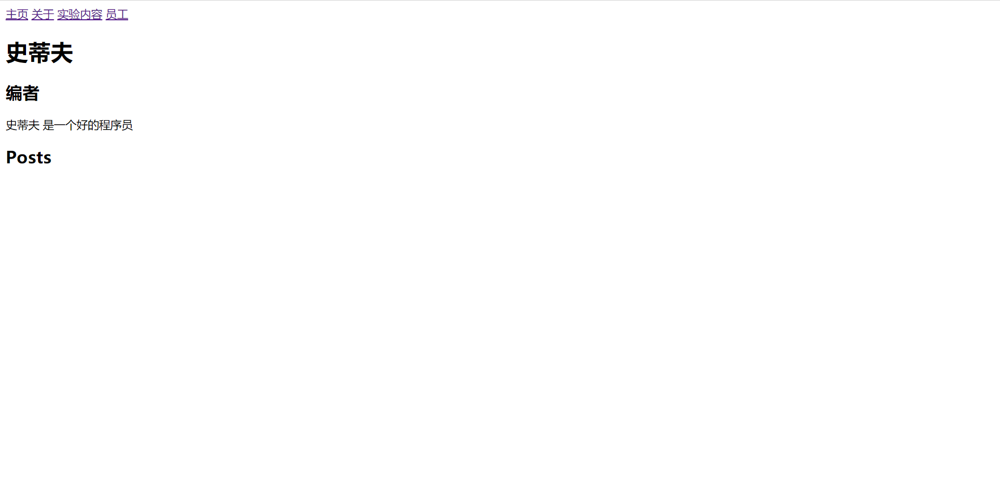
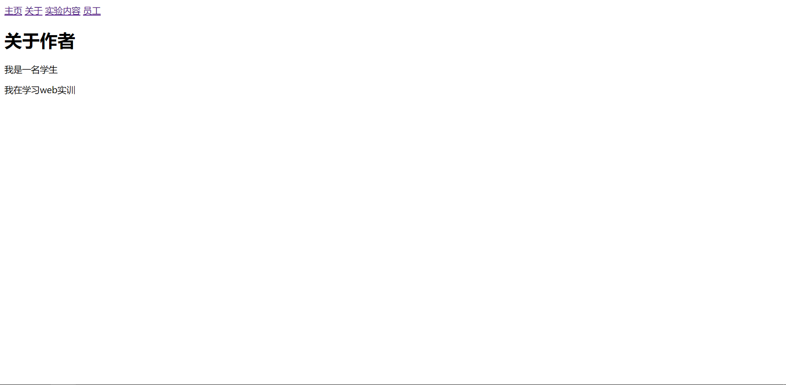

# WEB应用软件开发实训 – 第二次作业 ― 开发一个静态网站

    网站的公网网址:https://github.com/Zengcheng283/newblog
    网站源代码Github仓库网址:https://github.com/Zengcheng283/newblog.git

## 一、网站目录结构

        .
        ├── 实验报告.md
        ├── about.md
        ├── assets
        │   └── css
        │       └── styles.scss
        ├── _authors
        │   ├── Steff.md
        │   └── Zenhc.md
        ├── blog.html
        ├── _config.yml
        ├── _data
        │   └── navigation.yml
        ├── Gemfile
        ├── Gemfile.lock
        ├── _includes
        │   └── navigation.html
        ├── index.html
        ├── _layouts
        │   ├── author.html
        │   ├── default.html
        │   └── post.html
        ├── page.url
        ├── _posts
        │   ├── 2021-3-15-Markdown表格.md
        │   ├── 2021-3-17-Markdown段落.md
        │   ├── 2021-3-18-Markdown高级技巧.md
        │   ├── 2021-3-19-Markdown链接.md
        │   ├── 2021-3-20-Markdown列表.md
        │   ├── 2021-3-21-Markdown区块.md
        │   └── 2021-3-22-Markdown图片.md
        ├── _sass
        │   └── main.scss
        ├── _site
        │   ├── 2021
        │   │   └── 03
        │   │       ├── 15
        │   │       │   └── Markdown表格.html
        │   │       ├── 17
        │   │       │   └── Markdown段落.html
        │   │       ├── 18
        │   │       │   └── Markdown高级技巧.html
        │   │       ├── 19
        │   │       │   └── Markdown链接.html
        │   │       ├── 20
        │   │       │   └── Markdown列表.html
        │   │       ├── 21
        │   │       │   └── Markdown区块.html
        │   │       └── 22
        │   │           └── Markdown图片.html
        │   ├── 实验报告.md
        │   ├── about.html
        │   ├── assets
        │   │   └── css
        │   │       ├── styles.css
        │   │       └── styles.css.map
        │   ├── authors
        │   │   ├── Steff.html
        │   │   └── Zenhc.html
        │   ├── blog.html
        │   ├── index.html
        │   ├── page.url
        │   └── staff.html
        └── staff.html

## 二、网站截图

## 三、实验过程

通过Step-by-Step页面，不断地向下推进，从首页开始，到关于和Staff页面。

在不断的钻研下，制作出了这个静态页面。

## 四、总结

在制作过程中，我遇见了无法进行编译的情况，根据网上教程教导的方法，来一步步推进，最后成功将页面使用jekyll编译出来了。